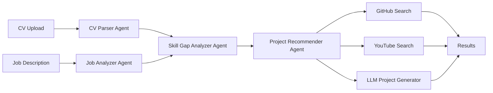

# CV Project Recommender 🎯

A production-ready agentic AI system that analyzes CVs against job descriptions, identifies skill gaps, and recommends tailored projects with learning resources.


## ✨ Features

### Frontend (Streamlit)
- **📄 Intelligent CV Parsing**: Automatically extracts skills, experience, education, and certifications from PDF/DOCX files
- **🎯 Job Analysis**: Analyzes job descriptions and categorizes required vs. preferred skills
- **📊 Skill Gap Analysis**: Identifies missing skills with fuzzy matching and prioritization
- **💡 Project Recommendations**: Generates tailored project ideas for each skill gap (beginner to advanced)
- **🔍 Resource Discovery**: Finds relevant GitHub repositories and YouTube tutorials
- **🗺️ Learning Paths**: Creates personalized roadmaps for skill acquisition
- **📈 Visual Analytics**: Interactive charts and progress tracking

### Backend (FastAPI)
- **🚀 REST API**: Complete API for CV analysis with async processing
- **⚡ Background Tasks**: Celery-based task queue for long-running operations
- **🔄 Real-time Updates**: WebSocket support for live progress tracking
- **📡 Job Management**: Submit, track, and retrieve analysis results
- **📚 API Documentation**: Auto-generated Swagger/ReDoc documentation
- **🐳 Docker Ready**: Multi-service containerized deployment

### Production Features
- **📝 Structured Logging**: JSON logs with rotation
- **💾 Caching**: Redis-based caching with TTL
- **⏱️ Rate Limiting**: Token bucket algorithm per API
- **🛡️ Error Handling**: Comprehensive error recovery
- **📊 Monitoring**: Celery Flower for task monitoring

## 🏗️ Architecture

### System Overview

```
┌─────────────────┐         ┌──────────────────┐
│  Streamlit UI   │         │   Other Clients  │
│   (Port 8501)   │         │  (Mobile/React)  │
└────────┬────────┘         └────────┬─────────┘
         │                           │
         └───────────┬───────────────┘
                     │
         ┌───────────▼────────────┐
         │   FastAPI Backend      │
         │     (Port 8000)        │
         └───────────┬────────────┘
                     │
         ┌───────────▼────────────┐
         │   Celery Worker        │
         │  (Background Tasks)    │
         └───────────┬────────────┘
                     │
    ┌────────────────┼────────────────┐
    │                │                │
    ▼                ▼                ▼
┌────────┐    ┌──────────┐    ┌──────────┐
│ Redis  │    │   LLM    │    │ External │
│ Cache  │    │ (OpenAI) │    │   APIs   │
└────────┘    └──────────┘    └──────────┘
                                 │
                    ┌────────────┼────────────┐
                    │            │            │
                    ▼            ▼            ▼
              ┌─────────┐  ┌─────────┐  ┌─────────┐
              │ GitHub  │  │ YouTube │  │  Other  │
              │   API   │  │   API   │  │   ...   │
              └─────────┘  └─────────┘  └─────────┘
```



### Agent Responsibilities

1. **CV Parser Agent**: Extracts structured data from CV documents using LLM
2. **Job Analyzer Agent**: Parses job descriptions and categorizes requirements
3. **Skill Gap Analyzer Agent**: Compares skills and identifies gaps with fuzzy matching
4. **Project Recommender Agent**: Generates projects and finds learning resources

## 🚀 Quick Start

### Prerequisites

- Python 3.11+
- OpenAI API key (required)
- GitHub Personal Access Token (optional, for better rate limits)
- YouTube Data API key (required)

### Installation

1. **Clone the repository**
   ```bash
   git clone <repository-url>
   cd AgenticProjectRecommender
   ```

2. **Create virtual environment**
   ```bash
   python -m venv venv
   source venv/bin/activate  # On Windows: venv\Scripts\activate
   ```

3. **Install dependencies**
   ```bash
   pip install -r requirements.txt
   ```

4. **Configure environment variables**
   ```bash
   cp .env.example .env
   ```
   
   Edit `.env` and add your API keys:
   ```env
   OPENAI_API_KEY=your_openai_api_key_here
   GITHUB_TOKEN=your_github_token_here
   YOUTUBE_API_KEY=your_youtube_api_key_here
   ```

5. **Run the application**
   ```bash
   streamlit run app.py
   ```

6. **Open your browser**
   Navigate to `http://localhost:8501`

## 🐳 Docker Deployment

### Using Docker Compose (Recommended)

```bash
# Build and start services
docker-compose up -d

# View logs
docker-compose logs -f

# Stop services
docker-compose down
```

The application will be available at `http://localhost:8501`

## 🚀 Running with FastAPI Backend

### Using Docker Compose (All Services)

```bash
# Start all services (Backend, Celery, Flower, Streamlit, Redis)
docker-compose up -d

# View logs
docker-compose logs -f

# Stop all services
docker-compose down
```

**Services:**
- **FastAPI Backend**: http://localhost:8000
- **API Documentation**: http://localhost:8000/api/docs
- **Celery Flower**: http://localhost:5555 (task monitoring)
- **Streamlit UI**: http://localhost:8501
- **Redis**: localhost:6379

### Running Locally (Development)

You'll need to run multiple services:

**Terminal 1 - Redis:**
```bash
redis-server
```

**Terminal 2 - Celery Worker:**
```bash
celery -A backend.tasks worker --loglevel=info
```

**Terminal 3 - FastAPI Backend:**
```bash
uvicorn backend.main:app --reload --port 8000
```

**Terminal 4 - Streamlit (Optional):**
```bash
streamlit run app.py
```

**Terminal 5 - Flower (Optional):**
```bash
celery -A backend.tasks flower --port=5555
```

## 📡 Using the API

### Quick API Example

```python
import requests

# 1. Submit CV for analysis
with open('cv.pdf', 'rb') as cv_file:
    response = requests.post(
        'http://localhost:8000/api/analyze',
        data={'job_description': 'Senior Developer with Python...'},
        files={'cv_file': cv_file}
    )

job_id = response.json()['job_id']

# 2. Check status
status = requests.get(f'http://localhost:8000/api/status/{job_id}').json()
print(f"Progress: {status['progress_percentage']}%")

# 3. Get results (when completed)
results = requests.get(f'http://localhost:8000/api/results/{job_id}').json()
print(f"Match: {results['result']['skill_match_analysis']['match_percentage']}%")
```

### API Endpoints

- `GET /api/health` - Health check
- `POST /api/analyze` - Submit CV for analysis
- `GET /api/status/{job_id}` - Check job status
- `GET /api/results/{job_id}` - Get analysis results
- `WebSocket /api/ws/{job_id}` - Real-time progress updates

See [API Documentation](docs/API.md) for complete details.

### Using the Python Client

```python
from examples.api_client import CVRecommenderClient

client = CVRecommenderClient("http://localhost:8000")

# Analyze and wait for results
results = client.analyze_and_wait(
    job_description="...",
    cv_file_path="cv.pdf",
    callback=lambda s: print(f"{s['progress_percentage']}%")
)
```

### Using Docker Only

```bash
# Build image
docker build -t cv-recommender .

# Run container
docker run -p 8501:8501 --env-file .env cv-recommender
```

## 📖 Usage Guide

### 1. Upload Your CV
- Supported formats: PDF, DOCX
- Ensure your CV includes skills, experience, education, and certifications

### 2. Paste Job Description
- Copy the complete job posting
- Include requirements, responsibilities, and qualifications

### 3. Analyze
- Click "Analyze & Generate Recommendations"
- Wait 30-60 seconds for processing

### 4. Review Results
- **Skill Match Analysis**: Visual breakdown of your match percentage
- **Skill Gaps**: Prioritized list of missing skills
- **Project Recommendations**: 3 projects per skill (beginner, intermediate, advanced)
- **Learning Resources**: Curated GitHub repos and YouTube tutorials
- **Learning Paths**: Step-by-step roadmaps

### 5. Export
- Download results as JSON for future reference

## 🔧 Configuration

### Environment Variables

| Variable | Required | Description |
|----------|----------|-------------|
| `OPENAI_API_KEY` | Yes | OpenAI API key for LLM |
| `OPENAI_MODEL` | No | Model to use (default: gpt-4-turbo-preview) |
| `GITHUB_TOKEN` | No | GitHub PAT for higher rate limits |
| `YOUTUBE_API_KEY` | Yes | YouTube Data API v3 key |
| `LOG_LEVEL` | No | Logging level (default: INFO) |
| `CACHE_ENABLED` | No | Enable caching (default: true) |
| `REDIS_HOST` | No | Redis host (default: localhost) |

### API Rate Limits

- **GitHub**: 60 req/hour (unauthenticated), 5000 req/hour (authenticated)
- **YouTube**: 10,000 quota units/day
- **OpenAI**: Depends on your plan

The system implements intelligent caching and rate limiting to stay within these bounds.

## 📁 Project Structure

```
AgenticProjectRecommender/
├── agents/                 # Agent implementations
│   ├── cv_parser.py
│   ├── job_analyzer.py
│   ├── skill_gap_analyzer.py
│   └── project_recommender.py
├── backend/                # FastAPI backend
│   ├── main.py            # FastAPI application
│   ├── schemas.py         # Request/response models
│   └── tasks.py           # Celery background tasks
├── graph/                  # LangGraph orchestration
│   ├── state.py
│   ├── nodes.py
│   └── workflow.py
├── integrations/           # External API clients
│   ├── github_search.py
│   ├── youtube_search.py
│   └── llm_client.py
├── models/                 # Pydantic data models
│   ├── cv_models.py
│   ├── job_models.py
│   └── recommendation_models.py
├── ui/                     # Streamlit components
│   └── components.py
├── utils/                  # Utilities
│   ├── logger.py
│   ├── cache.py
│   ├── rate_limiter.py
│   └── error_handler.py
├── docs/                   # Documentation
│   └── API.md             # API documentation
├── examples/               # Usage examples
│   └── api_client.py      # Python API client
├── tests/                  # Tests
│   └── test_agents.py
├── app.py                  # Streamlit app
├── config.py               # Configuration
├── requirements.txt        # Dependencies
├── Dockerfile              # Docker config
├── docker-compose.yml      # Multi-service setup
└── README.md              # This file
```

## 🧪 Testing

```bash
# Run all tests
pytest

# Run with coverage
pytest --cov=. --cov-report=html

# Run specific test file
pytest tests/test_agents.py
```

## 🔒 Security Notes

- Never commit your `.env` file
- Use environment variables for all API keys
- Rotate API keys regularly
- Use GitHub tokens with minimal required scopes

## 🤝 Contributing

Contributions are welcome! Please:

1. Fork the repository
2. Create a feature branch
3. Make your changes
4. Add tests
5. Submit a pull request

## 📝 License

This project is licensed under the MIT License.

## 🙏 Acknowledgments

- **LangGraph** for agent orchestration
- **LangChain** for LLM integration
- **Streamlit** for the web interface
- **OpenAI** for GPT models

## 📧 Support

For issues, questions, or suggestions:
- Open an issue on GitHub
- Check the FAQ in the app's Instructions tab

## 🗺️ Roadmap

- [ ] Support for more CV formats (LinkedIn PDF, plain text)
- [ ] Multi-language support
- [ ] Integration with job boards (LinkedIn, Indeed)
- [ ] Skill assessment quizzes
- [ ] Progress tracking dashboard
- [ ] Community project sharing

---

**Built with ❤️ using LangGraph and Streamlit**
